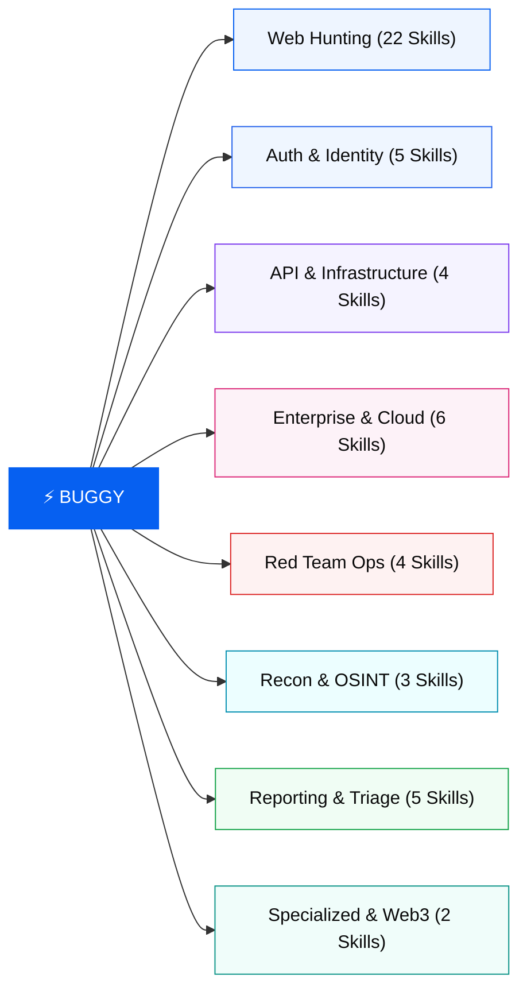
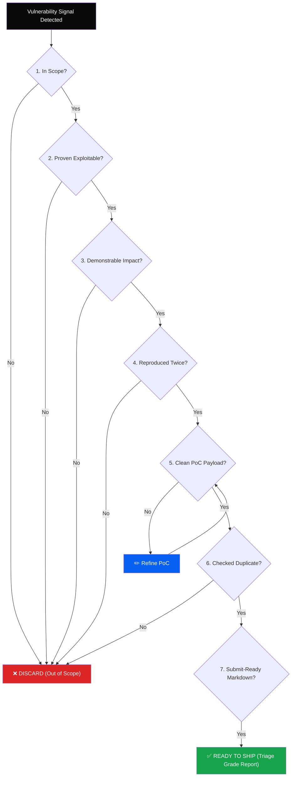

<div align="center">


# ⚡ BUGGY

**51 Production-Ready Claude Skills & Offensive Security Intelligence Toolkit**

[](https://github.com/bimoadis/Buggy)
[](https://github.com/bimoadis/Buggy/tree/main/skills)
[](https://github.com/bimoadis/Buggy)
[](https://github.com/bimoadis/Buggy/blob/main/docs/7-question-gate.mdx)
[](LICENSE)

[**Explore Web App →**](https://buggy-wheat-seven.vercel.app/) • [**Documentation**](https://buggy-wheat-seven.vercel.app/docs) • [**Browse 51 Skills**](https://buggy-wheat-seven.vercel.app/skills) • [**Report Issues**](https://github.com/bimoadis/Buggy/issues)

</div>

---

## 🎯 Overview

**Buggy** is an advanced offensive security and bug hunting context library designed for **Claude Code (CLI)** and **Claude Chat (Web)**. 

Every skill is a standalone, self-contained `SKILL.md` context bundle distilled directly from **574+ disclosed HackerOne, Bugcrowd, and Intigriti reports**. Skills contain verified real-world bypass patterns, precision exploitation techniques, and automated report generators equipped with a mandatory **7-Question Quality Gate** to eliminate speculative submissions.

---

## ⚡ Key Capabilities

- 🔍 **Live Target Hunting (Claude Code)** — Run `/hunt https://target.com` for full-pipeline subdomain discovery, port probing, and vulnerability mapping with real-time terminal streaming.
- 📋 **Static Code Review (Claude Chat)** — Paste source code snippets, HTTP request/response logs, or JWT tokens to receive structured vulnerability analysis and remediation diffs.
- 🛡️ **7-Question Quality Gate** — Built-in quality filter that rigorously verifies scope, exploitability, impact, and repeatability before generating reports. If one criterion fails, the finding is discarded.
- 🧠 **Context-Aware Auto-Loading** — Skills trigger automatically upon encountering matching input signals (e.g., token parameters load auth skills, `.apk` files trigger mobile pipeline).
- 📝 **Standardized Triage Reports** — One-click markdown generation formatted specifically for HackerOne, Bugcrowd, and Intigriti triage teams with CVSS 3.1 scoring.

---

## 🌐 8 Attack Domains (51 Skills)



| Domain | Skills | Focus Areas |
|---|:---:|---|
| **Web Hunting** | 22 | SQLi, XSS, SSRF, IDOR, RCE, XXE, SSTI, Race Conditions, Cache Poisoning, HTTP Smuggling |
| **Auth & Identity** | 5 | OAuth 2.0 / OIDC, SAML, Account Takeover (ATO), MFA Bypass, Broken Object Level Auth |
| **API & Infra** | 4 | GraphQL Introspection, Cloud S3/Blob Misconfigurations, REST API Auth, NTLM Info Leaks |
| **Enterprise** | 6 | Microsoft 365 / Entra ID, Okta, VMware vCenter, Cloud IAM Privilege Escalation, SharePoint |
| **Red Team** | 4 | Android APK Decompilation & Hardcoded Secrets, Supply Chain Recon, EDR/IR Evasion |
| **Recon & OSINT** | 3 | Automated Subdomain Enumeration, Identity Fabric, Dork Corpora, Sector Profiling |
| **Reporting** | 5 | 7-Question Quality Gate, HackerOne/Bugcrowd Templates, CVSS 3.1 Calculation, Evidence Hygiene |
| **Specialized** | 2 | Smart Contract Audit (Solidity), Web3 Token Security & Meme-coin Forensics |

---

## 🚦 The 7-Question Quality Gate

Every finding must clear all 7 questions before a report artifact is generated:



---

## 🚀 Quick Start Guide

### Option 1: Live Target Hunting with Claude Code (CLI)

```bash
# 1. Clone repository
git clone https://github.com/bimoadis/Buggy.git
cd Buggy

# 2. Launch Claude Code in project root
claude

# 3. Execute hunt slash command
/hunt https://target.com

# 4. Or target specific vulnerability classes
/hunt-sqli https://target.com/api/v1/search?q=1
```

### Option 2: Static Audit with Claude Chat (Web)

1. Download or package the [`skills/`](./skills) folder into a `.zip`.
2. Go to [claude.ai/customize/skills](https://claude.ai/customize/skills) and upload the skill archive.
3. Paste code, configurations, or HTTP logs into chat and invoke the command (e.g. `/hunt-oauth`).

### Option 3: Run the Web Showcase Locally

```bash
# Navigate to web directory
cd web

# Install dependencies
npm install

# Start development server
npm run dev

# Open in browser: http://localhost:3000
```

---

## 💻 Available Slash Commands

| Command | Syntax | Description |
|---|---|---|
| `/hunt` | `/hunt [target]` | Full automated recon + multi-vector vulnerability scanning |
| `/hunt-sqli` | `/hunt-sqli [url]` | Deep SQL injection testing (Time-based, Error-based, Boolean Blind) |
| `/hunt-xss` | `/hunt-xss [url]` | Contextual XSS auditing (DOM, Reflected, Stored, Mutation) |
| `/hunt-oauth` | `/hunt-oauth [url]` | OAuth 2.0 redirect validation, token leak, and state bypass testing |
| `/hunt-ssrf` | `/hunt-ssrf [url]` | Server-Side Request Forgery & Cloud Metadata endpoint auditing |
| `/hunt-idor` | `/hunt-idor [url]` | Insecure Direct Object Reference & Broken Access Control validation |
| `/recon` | `/recon [domain]` | 5-stage recon pipeline (DNS, Subdomains, Tech Stack, Probes) |
| `/triage` | `/triage` | Execute the 7-Question Gate filter on current findings |
| `/report` | `/report` | Generate structured markdown report with CVSS 3.1 and PoC |
| `/chain` | `/chain` | Correlate multi-step vulnerabilities into a critical exploit chain |

---

## 📂 Repository Structure

```text
Buggy/
├── skills/                  ← 51 Production SKILL.md Context Bundles
│   ├── web-hunting/         ← 22 Web Application Vulnerability Skills
│   ├── auth-identity/       ← 5 Authentication & Identity Skills
│   ├── api-infra/           ← 4 API, Cloud & Network Misconfig Skills
│   ├── enterprise/          ← 6 Enterprise Architecture (M365, Okta, vCenter) Skills
│   ├── red-team/            ← 4 Red Team Tactics & Mobile Security Skills
│   ├── recon-osint/         ← 3 OSINT, Threat Intelligence & Surface Mapping
│   ├── reporting/           ← 5 Quality Gates, Triage Validation & Report Templates
│   └── specialized/         ← 2 Web3 & Smart Contract Security Skills
│
├── commands/                ← 15 Automated Slash Command Definitions
│   ├── hunt.md              ← Primary Hunting Pipeline
│   ├── triage.md            ← 7-Question Quality Gate Engine
│   ├── report.md            ← Triage-Ready Report Generator
│   └── ...
│
├── web/                     ← Next.js 14 Web Application Showcase
│   ├── app/                 ← App Router Pages (Home, Skills, Docs)
│   ├── components/          ← Technical Brutalist Components & AI Modal
│   ├── content/             ← Skills & Domain Catalog Data
│   └── public/              ← Brand Logos & Mascot Assets
│
├── docs/                    ← System Architecture & Guide Documentation
└── tests/                   ← Automated Vitest Structural Validation Suite
```

---

## 📜 Ethical & Responsible Usage Policy

> [!IMPORTANT]
> **Buggy is designed exclusively for authorized security testing, sanctioned bug bounty programs, and educational purposes.**
> Any unauthorized testing against targets without explicit written permission is strictly prohibited. The maintainers assume no liability for misuse.

---

## 📄 License

Distributed under the **MIT License**. See [`LICENSE`](LICENSE) for more details.

<div align="center">
  <sub>Engineered for professional bug bounty hunters & red teams.</sub>
</div>
